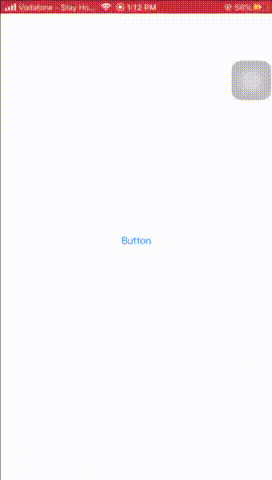

# YPicker
## Animated elegant easy to use data&amp; date picker
------------------------------------------------
 <br/>
YPicker comes in two classes: <br/>
1: YDataPicker and it can be used in two ways: <br/>
1: By Passing array of objects and passing the KeyPath of the string variable you are going to display like below:

```javascript
import UIKit
import YPicker

class ViewController: UIViewController {
  
  let picker = YDataPicker()
  
  override func viewDidLoad() {
     super.viewDidLoad()
     
     let objArray = [YourClassOrStruct(stringVar: "Some", intVar: 0, anyVar: nil),
                     YourClassOrStruct(stringVar: "Dummy", intVar: 1, anyVar: nil),
                     YourClassOrStruct(stringVar: "Data", intVar: 2, anyVar: nil)]
     
     picker.setData(data: objArray, key: \.stringVar)
     
  }

}
```

Or <br/>
2-just passing an array of strings like below:

```javascript
import UIKit
import YPicker

class ViewController: UIViewController {
  
  let picker = YDataPicker()
  
  override func viewDidLoad() {
     super.viewDidLoad()
     
     let stringArray = ["Some", "Other", "Dummy", "Data"]
       
     picker.setData(data: stringArray)
  }

}
```
And simply call:

```javascript
picker.show(inView: self.view)
```
<br/>  <br/>
And to access selected index: 
```javascript
picker.selectedIndex
```
The Second Class is <br/>
2- YDatePicker
 
```javascript
import UIKit
import YPicker

class ViewController: UIViewController {
  
  let picker = YDatePicker()
  
  override func viewDidLoad() {
     super.viewDidLoad()
     
     //YDatePicker Customization
     picker.pickerMode = UIDatePicker.Mode.dateAndTime //it is dateAndTime by default
     picker.minimumDate = Date() // It is nil by default
     picker.maximumDate = Date() //It is nil by default
     
  }

}
```
To get the selected date:
```javascript
picker.selectedDate
```
show method just like the other <br/>
```javascript
picker.show(inView: self.view)
```
<br/>Some common customizations <br/>
```javascript
  picker.seletorColor: UIColor = .lightGray // lightGray is the default
  picker.fontColor: UIColor = .black // black is the default
  picker.doneBtnTitle = "Done" //"Done" is the default 
  picker.doneTextColor = UIColor.blue
  picker.pickerBackgroundColor = UIColor.white //default is off white
```
